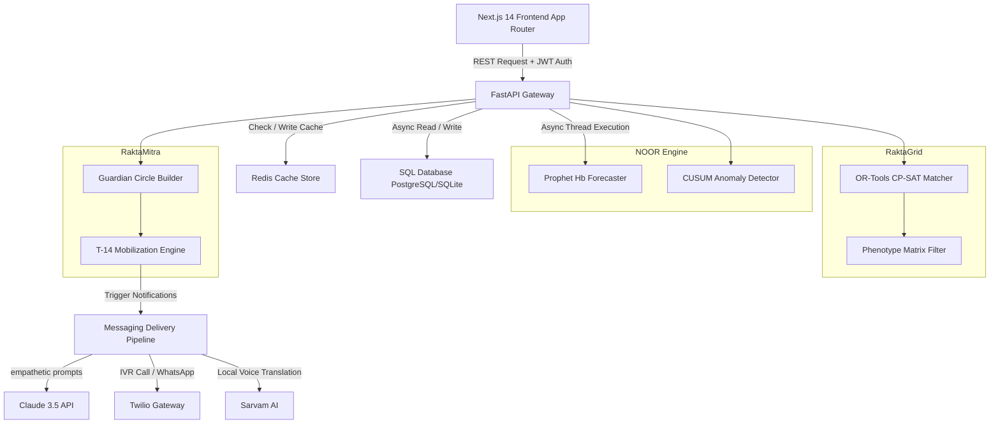
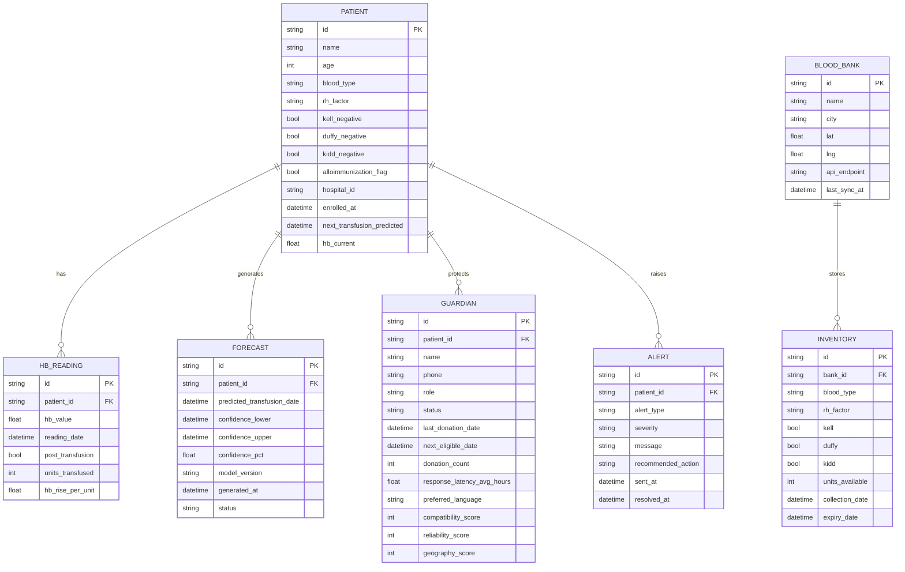

# RaktaSetu NOOR — Complete System Architecture & Documentation Manual
> **Comprehensive System Specification for a Predictive, Resilient, and Optimized Thalassemia Transfusion Ecosystem.**

---

## 1. Executive Summary & Product Vision

### 1.1 The Thalassemia Crisis in India
India has the largest concentration of Thalassemia Major patients globally, with approximately **2 lakh patients** who require life-saving blood transfusions every **21 days**. 

Despite Thalassemia being mathematically predictable, the current operational model is highly reactive and fragmented:
1. **Clinical Blindness:** Clinicians have no early warning systems to detect when a patient's body starts rejecting transfused blood (alloimmunization) or experiencing systemic iron overload.
2. **Relationship Decay:** Donor platforms focus on transactional, one-off acquisitions rather than long-term relationship cultivation. Every 21-day cycle is treated as a fresh cold outreach campaign.
3. **Inventory Isolation:** Blood banks operate as informational silos. Rare, matched blood units expire in one city bank while patients die waiting for them in a neighboring hospital.

### 1.2 The RaktaSetu NOOR Solution
RaktaSetu NOOR addresses these challenges by uniting three core system innovations into a single, cohesive clinical and logistical platform:

```
┌─────────────────────────────────────────────────────────────────────────┐
│                           RAKTASETU NOOR                                │
├──────────────────────────┬──────────────────────────────┬───────────────┤
│       NOOR Engine        │          RaktaMitra          │   RaktaGrid   │
│    (Clinical Brain)      │     (Relationship OS)        │(Inventory Grid)│
├──────────────────────────┼──────────────────────────────┼───────────────┤
│ • Prophet Hb Forecasting │ • Resilient Guardian Circles │ • CP-SAT Match│
│ • CUSUM Alloimmunization │ • Engagement & Coverage      │ • Haversine   │
│ • Ferritin Trend Alerts  │ • T-14 Mobilization Engine   │ • Waste Minim.│
└──────────────────────────┴──────────────────────────────┴───────────────┘
```

* **🧠 NOOR Engine (Clinical Brain):** Predicts the exact date of a patient's next transfusion using probabilistic time-series forecasting (Facebook Prophet) and automatically flags early signs of alloimmunization (Cumulative Sum Anomaly Detection).
* **🛡️ RaktaMitra (Relationship OS):** Establishes a permanent **Guardian Circle** of 8 dedicated donors per patient, shifting from crisis-driven donor pools to a structured, scheduled relationship network.
* **🌐 RaktaGrid (Inventory Grid):** Connects city-wide blood banks and coordinates real-time inventory matching using constraint programming (Google OR-Tools), prioritizing near-expiry matches to minimize waste.

---

## 2. Technical Stack & Architecture

### 2.1 Technology Selection Matrix

| Layer | Technology | Selection Rationale |
| :--- | :--- | :--- |
| **Frontend** | **Next.js 14 (App Router)** | Provides high-performance Server-Side Rendering (SSR) and React Server Components (RSC) for immediate dashboard initialization. |
| **Styling & UI** | **Tailwind CSS & shadcn/ui** | Facilitates rapid, harmonized UI implementation using pre-designed, accessible component primitives. |
| **API Backend** | **FastAPI 0.111 (Python 3.11)**| Native async execution, autogenerated OpenAPI schemas, and seamless integration with Python's ML ecosystem. |
| **ORM** | **SQLAlchemy 2.0 & Alembic** | High-performance async database access layer using modern Mapped type-annotations. |
| **Databases** | **PostgreSQL (Production) / SQLite (Local)** | Relational integrity for patient, donor, and bank records. Local SQLite defaults to relative paths for zero-config onboarding. |
| **Caching** | **Redis 7 (Upstash)** | Sub-millisecond read access for pre-computed patient forecasts and active guardian circle states. |
| **Forecasting** | **Facebook Prophet 1.1.5** | Probabilistic time-series modeling capable of handling seasonal trends and sparse clinical inputs. |
| **Optimization** | **Google OR-Tools 9.10** | CP-SAT solver designed for multi-objective, integer-constrained transportation and allocation problems. |
| **Empathetic AI**| **Anthropic Claude 3.5 Sonnet** | Contextual prompt engineering generating highly personalized, multi-lingual donor communication. |
| **Indian Voice** | **Sarvam AI** | Localized Speech-to-Text (STT) and Text-to-Speech (TTS) integration across 10 major Indian languages. |
| **Delivery** | **Twilio (WhatsApp & IVR)** | Dual-channel automation for automated voice calls and WhatsApp mobilization campaigns. |

### 2.2 System Block Architecture & Data Routing



### 2.3 Entity-Relationship Diagram (Database Schema)



---

## 3. Clinical Intelligence Engine (NOOR Engine)

The **NOOR Engine** forms the clinical logic core of the system. It handles two major analytical tasks: predicting hemoglobin decay and detecting transfusion anomalies.

### 3.1 Hemoglobin Decay Forecasting
Predicting when a Thalassemia patient will cross their safe clinical hemoglobin threshold requires analyzing variable decay rates. NOOR handles this with a dual-algorithm approach:

#### 3.1.1 Facebook Prophet Time-Series Model
Prophet is utilized to model the patient's long-term hemoglobin levels:
$$\hat{y}(t) = g(t) + s(t) + h(t) + \epsilon_t$$
* Where $g(t)$ represents the trend, $s(t)$ represents seasonality, $h(t)$ represents holiday effects, and $\epsilon_t$ represents the error term.
* **Model Configuration:** 
  * `yearly_seasonality=False`, `weekly_seasonality=False`, `daily_seasonality=False` (to focus purely on patient-specific cycles rather than calendar attributes).
  * `interval_width=0.80` to project an 80% confidence interval.
* **Custom Regressor:** An additional regressor is configured for `post_transfusion` (binary flag). This allows the model to map the rapid rise in hemoglobin immediately following a transfusion, separating it from the underlying linear decay trend.

```
Hb (g/dL)
  11 |      /\          /\          /\
  10 |     /  \        /  \        /  \        *--- Prophet yhat_upper
   9 |    /    \      /    \      /    \      /
   8 |   /      \    /      \    /      \----*---- Prophet yhat (Predicted)
   7 |  /        \  /        \  /        \  / \
   6 | /          \/          \/          \/   *--- Prophet yhat_lower
     +-------------------------------------------------------------> Time
                                           ^
                                       Crossing (Threshold = 7.0)
```

#### 3.1.2 Physiological Linear Decay Fallback
If the mathematical model fails to converge (due to highly sparse or irregular data), the system automatically falls back to a **Physiological Linear Decay Model**:
1. It analyzes previous transfusion cycles to extract the decay rate:
   $$\text{Decay Rate} = \frac{\text{Hb}_{\text{post}} - \text{Hb}_{\text{pre}}}{\Delta t_{\text{days}}}$$
2. **Physiological Guardrails:** The decay rate is validated against standard medical limits:
   $$0.05 \le \text{Decay Rate} \le 0.40 \text{ g/dL per day}$$
   If calculated rates fall outside this envelope, the system defaults to the clinical baseline:
   $$\text{Decay Rate}_{\text{default}} = 0.15 \text{ g/dL per day}$$
3. The next transfusion date is predicted by projecting this slope from the patient's latest hemoglobin reading down to their transfusion threshold (7.0 g/dL for adults, 7.5 g/dL for pediatric cases under 12).
4. Caching is handled using Redis with a 24-hour Time-to-Live (TTL) to guarantee sub-100ms API response times.

### 3.2 CUSUM Alloimmunization Detection
Repeated transfusions put patients at risk of developing antibodies against minor blood group antigens (kell, duffy, kidd). This condition, **alloimmunization**, causes the body to destroy transfused cells rapidly, resulting in a significantly lower hemoglobin rise per unit of blood.

NOOR detects this by monitoring the patient's post-transfusion hemoglobin recovery using a **Cumulative Sum (CUSUM)** control chart, which is highly sensitive to small, persistent shifts in a process mean.

#### Mathematical Formulation
1. **Recovery Calculation:** For each transfusion cycle $t$, calculate the recovery rate:
   $$\text{Rise}_t = \frac{\text{Hb}_{\text{post}} - \text{Hb}_{\text{pre}}}{\text{Units Transfused}}$$
2. **Baseline Initialization:** Establish the patient's normal recovery baseline using their first 3 historical cycles:
   $$\mu = \frac{1}{3}\sum_{t=1}^{3}\text{Rise}_t$$
3. **Cumulative Summation:** For all subsequent cycles $t \ge 4$, compute the cumulative deviation:
   $$S_t = \max(0, S_{t-1} + (\mu - \text{Rise}_t) - K)$$
   * $S_0 = 0$
   * $K = 0.5$ (the reference value or slack parameter, representing half the shift size we want to detect).
4. **Anomaly Flagging:** The engine raises an alert if the cumulative sum exceeds the warning threshold $H$:
   $$S_t > H \quad \text{where } H = 0.4$$
   Crossing this threshold flags the patient as `alloimmunization_flag = True`, alerting clinical coordinators and prompting the matching engine to switch to extended phenotype matching.

---

## 4. Guardian Circles (RaktaMitra)

RaktaMitra replaces unstable general donor pools with a dedicated, permanent circle of 8 donors per patient.

```
                     ┌──────────────────┐
                     │     PATIENT      │
                     └────────┬─────────┘
                              │ Enrolls
                              ▼
            ┌──────────────────────────────────┐
            │   Guardian Circle of 8 Donors    │
            │                                  │
            │  ┌──────────┐  ┌──────────┐      │
            │  │ Primary  │  │ Primary  │ ...  │ (Top 3 - standard match)
            │  └──────────┘  └──────────┘      │
            │  ┌──────────┐  ┌──────────┐      │
            │  │Secondary │  │Secondary │ ...  │ (Top 3 - backup reserve)
            │  └──────────┘  └──────────┘      │
            │  ┌──────────┐  ┌──────────┐      │
            │  │   Rare   │  │   Rare   │ ...  │ (Top 2 - antigen match)
            │  └──────────┘  └──────────┘      │
            └──────────────────────────────────┘
```

### 4.1 Circle Matching & Scoring Algorithm
When establishing a patient's circle, donor candidates are scored out of a maximum of 100 points based on four key operational weights:

$$\text{Donor Score} = w_{\text{compat}}\cdot S_{\text{compat}} + w_{\text{rel}}\cdot S_{\text{rel}} + w_{\text{geo}}\cdot S_{\text{geo}} + w_{\text{pheno}}\cdot S_{\text{pheno}}$$

#### Scoring Weights Definition
* **$w_{\text{compat}} = 0.40$ (Compatibility Score - Max 40 points):** Direct ABO/Rh blood type compatibility. An exact match yields 40 points. Compatible alternatives receive partial points.
* **$w_{\text{rel}} = 0.20$ (Reliability Score - Max 20 points):** Evaluated based on past donation success rates and average response latency:
  $$S_{\text{rel}} = 10 \cdot \left(\frac{\text{Completed Donations}}{\text{Total Pledges}}\right) + 10 \cdot \left(1 - \frac{\text{Avg Response Latency (Hours)}}{72}\right)$$
* **$w_{\text{geo}} = 0.20$ (Geographic Score - Max 20 points):** Based on the distance between the donor and the patient's primary hospital:
  * Same city code: 20 points.
  * $< 50\text{ km}$: 10 points.
  * $> 50\text{ km}$: 0 points.
* **$w_{\text{pheno}} = 0.20$ (Phenotype Match - Max 20 points):** Checks compatibility across minor antigens (Kell, Duffy, Kidd). Critical for alloimmunized patients.

### 4.2 Circle Health Scoring
The network continuously monitors circle health across three key metrics:
1. **Coverage Score ($C_{\text{cov}}$):** Tracks circle completion:
   $$C_{\text{cov}} = \left(\frac{\text{Active Guardians}}{8}\right) \times 100$$
2. **Engagement Score ($E_{\text{eng}}$):** Measures donor responsiveness:
   $$E_{\text{eng}} = \max\left(0, 100 \cdot \left(1 - \frac{\text{Avg Latency (Hours)}}{72}\right)\right)$$
3. **Resilience Score ($R_{\text{res}}$):** Calculates the probability that the circle can support the patient if two primary donors are simultaneously unavailable:
   $$R_{\text{res}} = \left( \frac{\text{Count of valid replacement donor pairs}}{\text{Total possible donor pairs}} \right) \times 100$$
   * A resilience score below 50% triggers the **Circle Repair Engine**, which automatically identifies new compatible donors to fill vulnerable slots.

### 4.3 T-14 Mobilization State Machine
Once the NOOR Engine predicts a transfusion date, RaktaMitra coordinates a step-by-step mobilization sequence:

```
    T-14 Days              T-10 Days               T-7 Days               T-3 Days           T-0 Days
 ┌──────────────┐       ┌──────────────┐        ┌───────────────┐      ┌──────────────┐    ┌─────────────┐
 │ Mobilization │ ───>  │  Soft Ask    │  ───>  │ Escalate /    │ ───> │ Final        │ ──>│ Transfusion │
 │  Triggered   │       │  (Primaries) │        │  (Secondaries)│      │ Logistics    │    │    Day      │
 └──────────────┘       └──────────────┘        └───────────────┘      └──────────────┘    └─────────────┘
                                                       │
                                                       ▼ (If < 3 Donors Confirmed)
                                                ┌───────────────┐
                                                │ Escalate to   │
                                                │  RaktaGrid    │
                                                └───────────────┘
```

1. **T-14 Days:** Mobilization is initialized in the database; the circle status updates to `active`.
2. **T-10 Days (Soft Ask):** Claude 3.5 generates personalized outreach messages. The system dispatches these messages to primary circle members in their preferred language (e.g., Telugu, Hindi).
3. **T-7 Days (Escalation & Booking):**
   * If primary donors confirm: The system schedules appointments and reserves blood bank slots.
   * If confirmations are pending: The system escalates outreach to secondary backup donors.
4. **T-3 Days (Logistics Lock):** Final coordination details are locked and sent to confirmed donors.
5. **T-0 Days (Transfusion Day):** The system triggers real-time check-in updates. If fewer than 3 donors confirm by T-3, the mobilization state shifts to `failed`, automatically triggering a city-wide inventory search on **RaktaGrid**.

---

## 5. City-Wide Inventory Optimization (RaktaGrid)

When a patient's local circle cannot fulfill their blood requirement, **RaktaGrid** searches city-wide inventory. It optimizes allocation by matching patient needs against blood bank supplies.

### 5.1 Optimization Problem Formulation
We model city-wide allocation as a multi-objective, integer-constrained binary assignment problem.

Let $P$ represent the set of patients requiring blood, and $U$ represent the set of individual, compatible blood units available across all city banks. We define a binary decision variable $x_{p, u}$ for each patient $p \in P$ and unit $u \in U$:

$$x_{p, u} = \begin{cases} 
1 & \text{if unit } u \text{ is assigned to patient } p \\ 
0 & \text{otherwise} 
\end{cases}$$

### 5.2 Objective Function
The optimizer maximizes a combined utility score $Z$, which balances compatibility, waste reduction, and logistics:

$$\max \quad Z = \sum_{p \in P} \sum_{u \in U} \left( \beta_{\text{match}} \cdot x_{p, u} + \beta_{\text{waste}}(u) \cdot x_{p, u} - \beta_{\text{dist}}(p, u) \cdot x_{p, u} \right)$$

Where:
* **$\beta_{\text{match}} = 1000$ (Allocation Utility):** Assures that matching compatible blood to patients is the solver's highest priority.
* **$\beta_{\text{waste}}(u)$ (Waste Prevention Utility):** Prioritizes units nearing their expiry date to prevent blood wastage:
  $$\beta_{\text{waste}}(u) = 10 \cdot (30 - \text{Days to Expiry}(u))$$
  * Assures that units expiring soonest are assigned first.
* **$\beta_{\text{dist}}(p, u)$ (Logistics Penalty):** Penalizes long-distance transport, prioritizing local transfers:
  $$\beta_{\text{dist}}(p, u) = 1 \cdot \text{Haversine Distance}(\text{Hospital}_p, \text{Bank}_u) \text{ in km}$$

### 5.3 Optimization Constraints
The solver operates under strict clinical and physical constraints:

1. **Supply Limit:** Each physical unit $u$ can be assigned to at most one patient:
   $$\sum_{p \in P} x_{p, u} \le 1 \quad \forall u \in U$$
2. **Demand Cap:** Each patient $p$ receives no more than their required units:
   $$\sum_{u \in U} x_{p, u} \le \text{Units Needed}_p \quad \forall p \in P$$
3. **Clinical Compatibility Filter:** Assignments are restricted to clinically compatible pairs. The variable $x_{p,u}$ is set to $0$ if:
   * ABO/Rh groups are incompatible.
   * The patient has an active `alloimmunization_flag` and the unit lacks matching minor antigens (Kell, Duffy, Kidd).
4. **Safety Expiry Buffer:** To prevent using blood that may expire before or during treatment, assignments must meet a minimum safety window:
   $$\text{Expiry Date}_u \ge \text{Predicted Transfusion Date}_p - 2\text{ Days}$$

### 5.4 CP-SAT Solver Execution
The model is executed using Google OR-Tools' **CP-SAT Solver**:
* **Thread Utilization:** Uses 4 parallel search workers.
* **Timeout Limit:** Capped at 30 seconds to prevent thread blocking, though standard city grids typically resolve in under 100ms.
* **Distance Calculation:** Calculated using the Haversine equation:
  $$d = 2R \arcsin\left(\sqrt{\sin^2\left(\frac{\Delta \phi}{2}\right) + \cos(\phi_1)\cos(\phi_2)\sin^2\left(\frac{\Delta \lambda}{2}\right)}\right)$$
  * Where $\phi$ represents latitude, $\lambda$ represents longitude, and $R = 6371\text{ km}$.

---

## 6. API Architecture & Data Contracts

All endpoints communicate using a standardized JSON envelope to ensure consistent integration between the Next.js frontend and the FastAPI backend.

### 6.1 Standard API Envelope Schema
```typescript
interface ApiResponse<T> {
  success: boolean;            // True if request succeeded
  data: T | null;              // Main payload (typed)
  error: ApiError | null;      // Error details if success is false
  meta?: ResponseMeta;         // Pagination or latency metadata
}

interface ApiError {
  code: string;                // Standardized error code
  message: string;             // User-friendly error message
  detail?: string;             // Detailed stack trace (debug environments only)
}
```

### 6.2 Standardized Error Codes

| Error Code | HTTP Status | Triggering Scenario |
| :--- | :--- | :--- |
| `PATIENT_NOT_FOUND` | 404 Not Found | Requested patient ID does not exist in the database. |
| `INSUFFICIENT_DATA` | 422 Unprocessable | Fewer than 3 Hb readings are available, making forecasting impossible. |
| `FORECAST_UNAVAILABLE` | 500 Internal Error | The Prophet time-series engine failed to compile or converge. |
| `GUARDIAN_CIRCLE_INCOMPLETE`| 422 Unprocessable | The patient has fewer than 8 active guardians in their circle. |
| `INVENTORY_MATCH_TIMEOUT` | 504 Gateway Timeout | The OR-Tools matching solver exceeded its 30-second time limit. |
| `MESSAGING_FAILED` | 502 Bad Gateway | Twilio or the Anthropic Claude API returned an delivery error. |
| `VALIDATION_ERROR` | 400 Bad Request | The request payload failed validation checks (Pydantic / Zod). |

---

## 7. Developer Onboarding & Local Setup

RaktaSetu NOOR defaults to a local SQLite configuration to simplify setup for new developers.

### 7.1 Local Environment Setup

#### 1. Repository Cloning & Environment Configuration
```bash
git clone https://github.com/PushkarPrabhath27/AiForGood.git
cd AiForGood

# Initialize environment variables from the template
copy .env.example .env
```

#### 2. Backend Installation (FastAPI)
```bash
cd backend

# Create and activate a Python virtual environment
python -m venv .venv
# Activate on Windows:
.venv\Scripts\activate
# Activate on macOS/Linux:
source .venv/bin/activate

# Install system build dependencies and python packages
pip install --upgrade pip
pip install -r requirements.txt
```

#### 3. Database Initialization & Seeding
```bash
# Run migrations to create the database schema
alembic upgrade head

# Seed the database with demo records (Priya, Vikram, Guardians, Blood Banks)
python db/seed_demo_data.py
```

#### 4. Launching the Development Server
```bash
uvicorn api.main:app --reload --host 0.0.0.0 --port 8000
```
* **API Sandbox:** Open [http://localhost:8000/docs](http://localhost:8000/docs) to access the interactive Swagger API documentation.
* **Health Check:** Confirm the backend status at [http://localhost:8000/health](http://localhost:8000/health).

---

## 8. Verification & Testing

The backend includes a comprehensive testing suite powered by `pytest` and `pytest-asyncio`.

```bash
# Run the complete test suite with coverage reporting
cd backend
pytest tests/ -v --cov=. --cov-report=term-missing
```

### Core Test Cases Definition
* **`test_noor_engine.py`:** Verifies Prophet forecasting and validates CUSUM anomaly detection against simulated patient cycles.
* **`test_guardian_service.py`:** Evaluates circle building and validates health scoring calculations.
* **`test_inventory_matcher.py`:** Tests OR-Tools optimization, verifying that compatible, near-expiry units are prioritized correctly.
* **`test_api_patients.py`:** Validates FastAPI endpoint routers and verifies auth token parsing logic.
