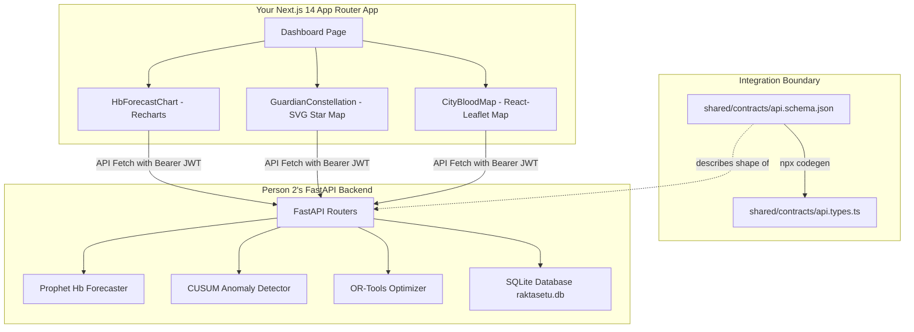

# 🤝 The Ultimate RaktaSetu NOOR Frontend Integration Manual
### A Beginner-Friendly, Step-by-Step Guide for Person 1 (Frontend Engineer)

Welcome to the **RaktaSetu NOOR** developer team! As **Person 1 (Frontend Engineer)**, you own the entire user interface and user experience. 

This guide is designed specifically for you. It assumes you are setting up your workspace from scratch and want a clear, highly detailed, and step-by-step roadmap to clone our code from GitHub, run the backend, connect your Next.js UI to our clinical data pipelines, and win this hackathon!

---

## 1. High-Level System Architecture

Before writing code, it is helpful to understand how our systems communicate. Person 2 (Backend Engineer) has built a highly advanced, clinical-grade backend using **FastAPI (Python)**, **Facebook Prophet** (for AI forecasting), and **Google OR-Tools** (for blood matching optimization). 

As the frontend engineer, you don't need to know how these AI models work under the hood. You will simply query our endpoints to fetch data, display it in beautiful UI dashboards, and send actions (like approving a match or logging a hemoglobin reading) back to the server.



---

## 2. Setting Up Your Local Workspace

Let's get your computer set up and pull our shared code from GitHub.

### Step 2.1: Clone the Repository
Open your terminal (PowerShell on Windows, or Terminal on macOS/Linux) and run these commands to clone the code and enter the directory:

```bash
# 1. Clone the shared repository
git clone https://github.com/PushkarPrabhath27/AiForGood.git

# 2. Enter the project root directory
cd AiForGood
```

### Step 2.2: Create and Check Out Your Feature Branch
To keep our git history clean, never push directly to `main`. Create your own branch and check it out:

```bash
# 1. Create and switch to your frontend development branch
git checkout -b dev/person1-frontend
```

---

## 3. Running the Backend Locally
To develop and test your React components, you will want the real backend running on your computer. Don't worry—you don't need to write Python. Just run these quick commands to spin it up:

> [!NOTE]
> Make sure you have **Python 3.11** installed on your machine.

```bash
# 1. Enter the backend folder
cd backend

# 2. Create a virtual environment to isolate python dependencies
python -m venv .venv

# 3. Activate the virtual environment
# On Windows:
.venv\Scripts\activate
# On macOS/Linux:
source .venv/bin/activate

# 4. Install backend dependencies
pip install -r requirements.txt

# 5. Run the local database migrations and seed demo data (Priya, Vikram, 5 Banks)
python db/seed_demo_data.py

# 6. Start the FastAPI development server
uvicorn api.main:app --reload --host 0.0.0.0 --port 8000
```

🎉 **Success!** Your local backend is now running at `http://localhost:8000`. 
* Open `http://localhost:8000/health` in your browser. You should see: `{"status": "ok", "version": "1.0.0"}`.
* Open `http://localhost:8000/docs` to see the interactive Swagger API documentation. You can test endpoints directly here!

---

## 4. The Magic of TypeScript Codegen

Person 2 has auto-generated a complete description of the backend API inside `shared/contracts/api.schema.json`. You do **not** need to manually write TypeScript interfaces for patients, match cards, or forecasts! 

We can compile the backend schema directly into static TypeScript types using a simple terminal generator:

```bash
# 1. Go back to your frontend project root directory
cd ../frontend

# 2. Run the schema-to-typescript compiler
npx json-schema-to-typescript ../shared/contracts/api.schema.json -o ../shared/contracts/api.types.ts
```

This will automatically create a file at `shared/contracts/api.types.ts` containing precise typings like `PatientSchema`, `ForecastResponse`, `GuardianSchema`, and `CityInventoryResponse`. 
Import these in your React pages to guarantee 100% type-safety and auto-complete in your IDE!

---

## 5. API Endpoints Reference Cheat Sheet

Here is a comprehensive directory of the backend endpoints available for you to consume. All responses are wrapped in a standard clinical envelope: `ApiResponse<T>` (which has `success: boolean`, `data: T | null`, and `error: ApiError | null`).

| **HTTP Method** | **API Route** | **Request Parameters / Payload** | **TypeScript Response Type** | **Description / Purpose** |
|---|---|---|---|---|
| `GET` | `/health` | None | `{"status": "ok", "version": "1.0.0"}` | Standard health ping. |
| `GET` | `/api/v1/patients` | None | `ApiResponse<PatientListResponse>` | Fetches all patients in the directory (Priya & Vikram). |
| `GET` | `/api/v1/patients/{patient_id}` | Path parameter: `patient_id` | `ApiResponse<PatientDetail>` | Retrieves detailed demographics & phenotype flags for one patient. |
| `POST` | `/api/v1/patients/{patient_id}/hb-reading` | JSON Body: `HbReadingCreate` | `ApiResponse<HbReadingResponse>` | Logs a new Hb value. Auto-computes Rise-per-unit if post-transfusion. |
| `GET` | `/api/v1/patients/{patient_id}/forecast` | Path parameter: `patient_id` | `ApiResponse<ForecastResponse>` | Fetches historical Hb points, Prophet forecast curve, and alerts. |
| `GET` | `/api/v1/patients/{patient_id}/guardian-circle` | Path parameter: `patient_id` | `ApiResponse<GuardianCircleResponse>` | Retrieves the 8-guardian circle, health scores, and mobilization status. |
| `POST` | `/api/v1/patients/{patient_id}/guardian-circle/mobilize` | Path parameter: `patient_id` | `ApiResponse<MobilizationStatusResponse>` | Activates the T-14 WhatsApp/SMS campaign. (Transitions Suresh to Active). |
| `GET` | `/api/v1/grid/city/{city_code}` | Path parameter: `city_code` (e.g., `HYD`) | `ApiResponse<CityInventoryResponse>` | Fetches blood banks, match recommendations, and type-by-type coverage. |
| `POST` | `/api/v1/grid/matches/{match_id}/approve` | Path parameter: `match_id` | `ApiResponse<str>` | Approves a bank-to-patient transfer, decrementing stock in DB. |
| `POST` | `/api/v1/chatbot/message` | JSON Body: `ChatbotMessageRequest` | `ApiResponse<ChatbotMessageResponse>` | Connects to Saathi virtual coordinator assistant. |

---

## 6. How to Build the 3 Hero Features (Your Integration Roadmap)

These are the three most important visual components that will win us the hackathon. Here is exactly how to hook them up to the backend:

### Feature 1: The Sawtooth Hb Forecast Chart (`HbForecastChart.tsx`)
Priya's hemoglobin follows a medical "sawtooth" curve—it spikes immediately after a transfusion, decays gradually over 21 days as her body consumes red cells, and must spike again.

```
Hb (g/dL)
  10.5 |    /\        /\
       |   /  \      /  \
   7.0 |  /    \    /    \   - - - - - - - [Transfusion Threshold]
       | /      \  /      \ - - - - - - - (Nov 3rd Predict Date)
   5.0 └────────────────────────────
          Oct 1    Oct 21   Nov 3
```

> [!TIP]
> **How to Integrate the Data:**
> 1. Query `GET /api/v1/patients/{priya_id}/forecast` to fetch the forecast payload.
> 2. Pass `data.historical_readings` to a Recharts `Line` element (solid blue stroke) to draw the past.
> 3. Pass `data.forecast_points` to a second `Line` element (dashed blue stroke, `strokeDasharray="6 4"`) to project the future.
> 4. Use a Recharts `Area` element mapping the `ci_lower` and `ci_upper` values to shade a translucent blue/gold confidence interval band.
> 5. Add a Recharts `<ReferenceLine y={7.0} stroke="#ef4444" strokeDasharray="3 3" />` indicating the clinical trigger threshold.

---

### Feature 2: The Star Constellation SVG (`GuardianConstellation.tsx`)
Rather than a boring donor list, we display Priya's 8 guardians as stars in a constellation map around her center gold core.

```
             Anita (Active)
          ★        ★ Mani (Active)
      ★                 ★
   Raju (Cooldown)      (Priya Gold Core)      ★ Suresh (Pulsing Pending)
      ★                 ★
          ★        ★
```

> [!IMPORTANT]
> **How to code the SVG Star Geometry:**
> 1. Do **not** use a charting library. Render it natively inside a clean, scalable `<svg viewBox="0 0 600 600">` element.
> 2. Position Priya's name in a golden `<circle r="40" fill="url(#goldGradient)" />` at coordinates `(300, 300)`.
> 3. Arrange the 8 guardians in a perfect circle using simple trigonometry loop index values:
>    ```javascript
>    const radius = 220;
>    const angle = (index * 2 * Math.PI) / 8 - Math.PI / 2;
>    const x = 300 + radius * Math.cos(angle);
>    const y = 300 + radius * Math.sin(angle);
>    ```
> 4. **Micro-Animations & Star Glows**:
>    * Define a soft radial blur in the SVG `<defs>` block for active stars:
>      ```xml
>      <filter id="glow"><feGaussianBlur stdDeviation="3" result="coloredBlur"/><feMerge><feMergeNode in="coloredBlur"/><feMergeNode in="SourceGraphic"/></feMerge></filter>
>      ```
>    * If a guardian's status is `'pending'`, apply a Tailwind scaling pulse animation (`animate-pulse`) to their SVG group `<g>` to indicate they were contacted.
>    * If status is `'cooldown'`, set `opacity="0.5"` to dim their star.

---

### Feature 3: The Leaflet Blood Map (`CityBloodMap.tsx`)
When Priya's circle fails or Vikram's alloimmunization triggers, the coordinator views a map of Hyderabad to request a transfer from an integrated blood bank.

> [!WARNING]
> **Rookie Gotcha: Leaflet SSR Hydration Crashes**
> Leaflet reads global browser objects like `window` and `document` during compilation. In Next.js App Router, this will immediately crash the server-side rendering (SSR) engine with a `ReferenceError: window is not defined` error.
> 
> **How to bypass this safely:**
> Always wrap your React-Leaflet imports using Next.js `dynamic()` with SSR disabled:
> ```typescript
> import dynamic from 'next/dynamic';
> 
> const CityBloodMap = dynamic(
>   () => import('@/components/grid/CityBloodMapInner'),
>   { 
>     ssr: false, 
>     loading: () => <LoadingSkeleton variant="chart" /> 
>   }
> );
> ```

---

## 7. Simple Integration Diagnostic Run

To prove your frontend connection is working before writing a single line of React UI, Person 2 has built a custom diagnostic client script right in the workspace.

Open a new terminal window in your project root and run:

```bash
# 1. Execute the diagnostic tool
python backend/debug_integration.py
```

It will execute direct integration checks against your running backend, printing outputs to confirm connectivity:
```text
Health: 200 {'status': 'ok', 'version': '1.0.0'}
Forecast: True date=2024-11-03
Guardians: coverage=100.0 engagement=94.0 resilience=87.0
```
If you see these outputs, **your backend is perfectly configured, fully seeded, and ready for you to build the UI!**

Good luck, Person 1! Let's build a hackathon-winning application. If you have any questions or hit schema mismatches, open an issue or ping Person 2!
